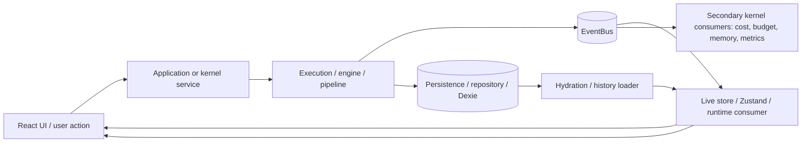
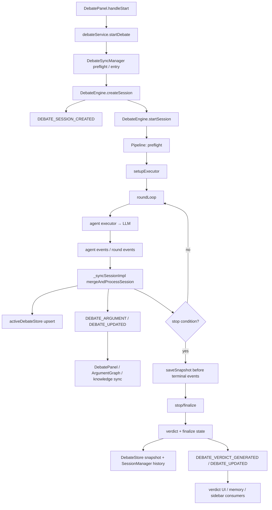

# Карта end-to-end сценариев AI OS New

**Дата анализа:** 2026-09-29  
**Репозиторий:** `https://github.com/egilyad/ai-os-new`  
**Проверенная ревизия:** `3d79f00982b4a9524857618da20086ad09f5e64c` (`3d79f00`)  
**Режим:** только чтение; код и существующие сущности не изменялись.

## 1. Как читалась система

Карта построена по фактическим импортам, DI-регистрации, вызовам `eventBus`, репозиториям/Dexie и UI-подпискам. Документация использовалась только как ориентир; в карту включены цепочки, для которых найдены реальные точки вызова и потребления.

Обозначения:

- **UI/action** — обработчик UI или kernel/API action.
- **Service/execution** — сервис, executor, pipeline или engine.
- **Event** — шина событий; это не persistence.
- **Persistence** — Dexie/DAL, `DebateStore`, `RivalRepository`, local storage adapter.
- **Consumer/UI** — Zustand/live store, React panel или вторичный kernel consumer.
- **Разрыв** — место, где цепочка не продолжена, данные могут быть потеряны/рассинхронизированы или существует альтернативный путь.

## 2. Глобальная архитектурная карта



Главный системный принцип: **runtime state и EventBus часто обновляются до или независимо от durable persistence**. Поэтому конечная точка разных контуров различна: иногда это UI-состояние, иногда запись в Dexie, иногда только runtime cache.

## 3. Контур A — обычный ChatPanel: сообщение пользователя → LLM → сохранённая сессия → UI

### Фактическая цепочка

```mermaid
flowchart TD
  A[ChatPanel.handleSend] --> B[useChatStore.sendMessage]
  B --> C{Busy / queue?}
  C -- yes --> Q[_sendQueue per session]
  C -- no --> D[distributed lock chat:session]
  D --> E[executionGovernor.start]
  E --> F[optional memory.search / memory.store]
  F --> G[workspace snapshot + agent persona + history]
  G --> H[Dexie write-through: syncSessions]
  H --> I[Zustand session history: loading response]
  I --> J[EventBus SEND_MESSAGE per target]
  J --> K[DI token chatService = ChatExecutor]
  K --> L[policy + prompt security + auto/race routing]
  L --> M[LLMClientService.sendMessage]
  M --> N[STREAM_START / STREAM_CHUNK]
  N --> O[chat-event-handlers update Zustand]
  M --> P[MESSAGE_RESPONSE done/error]
  P --> O
  M --> R[STREAM_END / STREAM_ERROR]
  R --> O
  O --> S[terminal Dexie put(session)]
  O --> T[ChatPanel re-render]
  R --> Q
  Q --> B
```

### Подтверждённые точки

- **UI:** `src/components/ChatPanel/ChatPanel.tsx:205-218` — `handleSend` вызывает `sendMessage`; regenerate использует тот же путь (`:254-271`).
- **Store/action:** `src/stores/chat/chat-send-message.ts:30-53` — получает active session, формирует request/entry id и очередь.
- **Предобработка:** `:54-170` — distributed lock, governor, RAG (`memoryService.search`), auto-store user prompt, workspace tree, agent persona.
- **Сборка контекста:** `:174-209` — system prompts, история, только `done` responses, новый user message.
- **Первичная durable запись:** `:224-280`, особенно `:248-271` — loading-entry пишется через session store до отправки события `SEND_MESSAGE`.
- **Execution event:** `:286-301` — один `SEND_MESSAGE` на target; `requestEntryMap` связывает request с session/entry.
- **DI wiring:** `src/kernel/service-registration/phase6-high-level.ts:99-123` — токен `chatService` реально создаёт `new ChatExecutor(...)`.
- **Важно:** отдельного фактического класса `ChatService.ts` в проверенной ревизии нет; название `ChatService` встречается в типах/тестах/исторических именах. Рабочий execution-компонент — `ChatExecutor`.
- **Executor:** `src/kernel/services/chat-executor.ts:30-41` подписывает `SEND_MESSAGE` и `CANCEL_MESSAGE`; `:102-220` выполняет policy/security/routing; `:368-425` вызывает LLM и эмитит streaming; `:475-527` эмитит terminal response и `STREAM_END`.
- **Ответ/стрим:** `src/stores/chat/chat-event-handlers.ts:119-163` принимает `MESSAGE_RESPONSE`; `:166-193` — `STREAM_START/CHUNK`; `:195-266` — `STREAM_END/ERROR`, закрытие active request, terminal persist и drain очереди.
- **Hydration:** `src/stores/chat/hydration.ts:129-180+` — liveQuery Dexie → Zustand; orphan `loading/streaming` при reload превращаются в error (`:13-28`).

### Ветвления

1. **Очередь:** busy send не теряется сразу; он помещается в `_sendQueue`, затем запускается на terminal event. При заполнении 50 сообщений сообщение отбрасывается с notification (`chat-send-message.ts:36-47`, `:79-99`).
2. **Мульти-target:** один пользовательский entry содержит несколько response; для каждого target отдельный request id (`:69-72`, `:211-235`, `:286-301`).
3. **RAG/auto-store:** memory failure не останавливает чат, только логируется; cancellation guard после async шага может остановить запрос.
4. **Provider:** `auto` выбирает ranked provider; `race` запускает race executor; policy для agent проверяется перед вызовом (`chat-executor.ts:127-145`, `:186-220`, race branch около `:700-782`).
5. **Cache:** cache hit отдаёт `MESSAGE_RESPONSE(done)` без обычного LLM stream; cache inflight coalesces одинаковые запросы (`:302-366`).
6. **Security:** prompt block — notification + security event + error response; output block — error response вместо результата (`:157-183`, `:434-471`).
7. **Ошибки/abort/timeout:** `STREAM_ERROR`, error response, stale TTL abort; при reload orphan response становится error.

### Конечная точка

Для обычного чата успешный конец — **terminal response в Zustand и snapshot сессии в Dexie**. Для ошибок — response со статусом `error` и также terminal snapshot. Дополнительно terminal events читают budget/cost/provider/trace/message-index consumers.

### Разрывы и риски

- **EventBus не является durable журналом.** Если consumer подписался после `STREAM_END`, событие не replay-ится; это явно отмечено в `event-bus.ts` как удалённый replay buffer.
- **Событие может быть успешным, а terminal persistence — асинхронным fire-and-forget:** `persistSessionSnapshot` вызывает `void sStore.put(...)`. Ошибка только логируется, UI уже считает ответ завершённым.
- **Прямые bypass-пути:** `KeyTable`, provider panels, `AdminService` и другие места эмитят `SEND_MESSAGE` напрямую, минуя ChatStore. У них нет автоматической записи в chat session; их конечная точка — собственные локальные UI listeners/метрики.
- **Queue drain зависит от terminal events.** Если execution не эмитит ни `STREAM_END`, ни `STREAM_ERROR`, queued messages останутся зависшими до cleanup/reload.
- **`emitStatus` генерирует request id fallback отдельно от payload key** (`chat-executor.ts:818-828`): это потенциальный разрыв correlation на статусных ветках, если request id отсутствует.
- **ChatStore и executor имеют разные state machines:** store ждёт terminal statuses, а executor может дать промежуточный `cached`; это учтено в Conversation engine, но прямые consumers должны фильтровать interim events.

## 4. Контур B — Conversation Director: сценарий → turns → ChatExecutor → conversation events → Director UI/history

### Фактическая цепочка

```text
DirectorPanel / Library action
  → ConversationDirectorService
  → ConversationOrchestrator / scenario execution
  → ChatExecutionEngine
  → ChatExecutor.handleMessage
  → SEND_MESSAGE → LLM
  → MESSAGE_RESPONSE или STREAM_ERROR
  → ChatExecutionEngine resolves TurnResult
  → director service advances scenario/session
  → conversation:* events
  → directorStore / RunTab UI
  → director repository persistence
```

- **Wiring:** `src/kernel/service-registration/phase20-director.ts:29-45` документирует реальный bridge `ScenarioRepository → ConversationDirectorService → ... → ChatExecutionEngine → chatService`.
- **Adapter:** `src/kernel/services/conversation-execution-engine.ts:30-95` формирует request с persona, topic, history, objective и metadata; `:98-158` подписывается на response/error и резолвит `TurnResult` только по terminal status.
- **Обратная связь:** `TurnResult` возвращается orchestrator’у, который определяет следующий turn/состояние сценария; это не тот же контур, что ChatPanel history.

### Конечная точка и разрывы

- Конечная точка — **completed/failed turn и director session record**, плюс UI feed/history.
- **Не обнаружена связь с ChatPanel session history:** ChatExecutionEngine использует ChatExecutor, но не вызывает `useChatStore.sendMessage`; обычная chat persistence не является persistence Director.
- Abort session signal отменяет request и разрешает failed turn (`:136-154`); если сторонний executor не отдаёт terminal event, promise может оставаться pending.
- Director event/UI path и ChatPanel event/UI path используют общий EventBus, поэтому broad consumers могут видеть чужие `MESSAGE_RESPONSE`; correlation по `requestId` обязателен.

## 5. Контур C — DebatePanel / legacy sync manager: старт → engine/pipeline → live updates → snapshot/history → verdict

### Фактическая цепочка



### Подтверждённые точки

- **UI action:** `src/components/DebatePanel/DebatePanel.tsx:301-312` передаёт topic, participants, strategy, rounds, config и active chat id в `debateService.startDebate`; human injection (`:334-355`) идёт отдельным service path.
- **Start orchestration:** `src/kernel/services/debate-runtime/debate-sync-manager.ts:249-311` — cooldown/owner guard, preflight, engine session, initial sync, `DEBATE_STARTED`, async start.
- **Engine creation:** `src/kernel/services/debate-runtime/debate-engine.ts:254-314` — создаёт runtime session, budget, phase handler, emit `DEBATE_SESSION_CREATED`.
- **Pipeline:** `src/kernel/services/debate-runtime/debate-pipeline-builder.ts:87-140` preflight/setup; `:141-395` round loop; `:398-473` consensus, LLM verdict, save verdict, completed.
- **Live sync:** `debate-sync-manager.ts:682-757` — merge/process, active store, governor, затем `DEBATE_ARGUMENT` и `DEBATE_UPDATED`; при stop snapshot сохраняется до событий (`:728-743`).
- **UI consumers:** `useDebatePanelSubscriptions.ts:80-139` слушает `debate:updated`; `:141-180` принимает verdict/cancel/fail; `ArgumentGraphPanel` слушает `DEBATE_UPDATED`, `DEBATE_ARGUMENT`, `DEBATE_CONSENSUS`.
- **Final persistence:** `debate-sync-manager.ts:834-857` — финализирует state, сохраняет полные arguments через `sessionManager.saveToDebateHistory`, затем emit finalize events.
- **History reload:** `src/kernel/services/session-manager-service.ts:395-437` читает `loadHistoryList`; `:439-464` сохраняет completed history и восстанавливает session.
- **Low-level persistence:** `src/kernel/services/debate-runtime/debate-session-persistence.ts:46-92` maps session → `DebateSessionRecord`; `:184-210` merge-on-save сохраняет meta; `:260-287` history list.
- **Timeline:** `src/kernel/services/debate-runtime/debate-timeline.ts:25-67` хранит last entries в `BucketStorageAdapter.RESEARCH` under `debate_timeline_<id>`; это отдельный persistence channel, не тот же snapshot.

### Ветвления

- **Natural completion:** consensus → LLM verdict (30s timeout) → completed.
- **Governor stop:** synthesis/consensus event → snapshot → cancel/finalize; создаётся heuristic verdict для ручного stop (`:513-632`).
- **Budget/provider failure:** round может перейти в `paused` или `failed` (`pipeline-builder.ts:281-295`).
- **Manual cancel/timeout:** before `cancelSession` engine snapshot is attempted (`sync-manager.ts:513-547`).
- **Resume/reload:** active/paused record загружается; zombie active старше 5 минут авто-fails, свежий active переводится в paused (`debate-session-persistence.ts:213-243`).
- **Chat linkage:** при старте, если `chatSessionId` не `default`, вызываются `sessionManager.link` и `updateMeta` (`sync-manager.ts:421-453`). Это связь метаданных, а не копирование сообщений.

### Конечная точка и разрывы

- Успешная конечная точка — **completed debate record + verdict record + history + UI verdict**.
- Cancelled/failed ветка **не проходит обычный LLM verdict/persistence history в `_finalizeInternal`** (`:805-830`): emits finalize events и очищает runtime; snapshot до cancel пытается сохранить состояние. Это сознательная семантика, но создаёт риск, что незавершённый спор будет виден live/в snapshot, но не в completed history.
- Timeline persistence — best effort: ошибка и quota fallback логируются/поглощаются; durable snapshot может сохраниться без timeline.
- `DEBATE_SESSION_COMPLETED` намеренно не слушается sync manager — используется `DEBATE_PHASE_CHANGED` (`:770-780`). Если phase event пропущен, финализация и UI update разойдутся.
- UI `DebatePanel` на cancel/fail очищает текущую session (`useDebatePanelSubscriptions.ts:157-180`), тогда как runtime/history могут ещё содержать данные. Это ожидаемая разница между live view и history, но при сбое пользовательский путь к восстановлению неочевиден.

## 6. Контур D — DebateRuntimePanel / topology debate: topology UI → pipeline → runtime live store

Это отдельный UI-вход в тот же `DebateSyncManager`, а не новая execution-система.

- **UI:** `src/components/DebateRuntimePanel/DebateRuntimePanel.tsx:232-314` строит `DebateTopology`, participants и вызывает `startTopologyDebate`.
- **Execution:** `debate-sync-manager.ts:314-359` создаёт engine session с переданной topology; далее тот же engine/pipeline/sync/finalize contour.
- **Consumers:** runtime panel слушает `DEBATE_SESSION_CREATED/STARTED/COMPLETED/FAILED/CANCELLED` (`:123-147`) и agent chunk/responded (`:148-224`), а `debateEngine.getActiveSessions()` используется для refresh.
- **Persistence/link:** тот же `DebateStore`/timeline/history; linked chat IDs читаются через `sessionManager.getLinked` (`:318-340`).

**Разрыв:** runtime panel получает live chunks из `DebateRuntimeEvents`, а legacy panel преимущественно получает `DEBATE_UPDATED`/`DEBATE_ARGUMENT`; два представления могут иметь различную полноту/момент обновления, несмотря на общий engine.

## 7. Контур E — Room invocation: UI request → policy/budget → execution delegate → conversation events → invocation record/UI

### Фактическая цепочка

```mermaid
flowchart TD
  A[RoomPanel.handleInvoke] --> B[InvocationRequest]
  B --> C[InvocationEngineService.invoke]
  C --> D[InvocationRepository.put requested]
  D --> E[INVOCATION_REQUESTED]
  E --> F[InvocationStore upsert/log]
  C --> G[evaluate policies]
  G --> H{allow?}
  H -- no --> I[put rejected + INVOCATION_REJECTED]
  H -- yes --> J[resolveAgents]
  J --> K{agents / budget valid?}
  K -- no --> I
  K -- yes --> L[put accepted + INVOCATION_ACCEPTED]
  L --> M[put executing]
  M --> N[execution.start(..., invocationId)]
  N --> O[conversation/debate execution]
  O --> P[CONVERSATION_TURN_START/COMPLETE/ERROR]
  P --> Q[InvocationStore feed]
  O --> R[completed promise]
  R --> S[put done + INVOCATION_DONE]
  S --> T[RoomPanel history/scoped feed/costs]
```

### Подтверждённые точки

- **UI:** `src/components/RoomPanel/RoomPanel.tsx:135-161` — форма строит `InvocationRequest`, source `human-mention`, caller `room-ui`, target agent, context/mode, затем `invocationEngine.invoke`.
- **Lifecycle/persistence:** `src/kernel/services/invocation/invocation-engine-service.ts:42-65` requested; `:66-89` policy/no-agent rejection; `:93-119` accepted + budget gate; `:124-155` executing + delegate; `:157-179` done/rejected после `completed`.
- **Repository:** `src/kernel/services/invocation/invocation-repository.ts:52-63` пишет/читает `db.invocations`; policy rows — `:105-113`.
- **Event consumer:** `src/stores/invocationStore.ts:94-180` maps lifecycle to live view/log and conversation events to feed; `:228-265` reloads history and costs.
- **UI history/scoping:** `RoomPanel.tsx:103-133` loads history and scopes feed by `sessionRef.ref`; `:357+` exposes details/open session.

### Конечная точка и разрывы

- Нормальная конечная точка — **invocation row status `done`, `INVOCATION_DONE`, scoped feed и accumulated cost**.
- Rejection after `accepted` is represented as `rejected`, so aggregate does not remain orphaned in `accepted`.
- **UI store не является источником истины:** он восстанавливается из repository через `loadHistory`; live events не replay-ятся.
- `execution.start` возвращает `completed: Promise<void>` и `target`; если delegate некорректно завершает promise, invocation останется `executing` навсегда.
- Feed depends on `conversation:*` events. Если execution делает только final persistence без этих events, invocation status может стать done, но feed будет пустым.
- Cost reload happens only on `INVOCATION_DONE`; partial/failed runs may have cost rows without immediate UI refresh.

## 8. Контур F — Projects: ProjectsPanel → ProjectService → ProjectRepository/Dexie → project events → project store

### Фактическая цепочка

```text
ProjectsPanel.handleCreate
  → projectManagerService.create
  → ProjectService.create
  → ProjectRepository.put(db.projects)
  → project:created
  → project-store reload/list
  → ProjectsPanel list
```

- **UI:** `src/components/ProjectsPanel/ProjectsPanel.tsx:100-107`.
- **Service:** `src/kernel/services/project-service.ts:47-64` creates project, writes repository, emits `project:created`.
- **Repository:** `src/kernel/dal/project-repository.ts:29-52` stores project and cascades delete to tasks/runs/files/artifacts/assignments.
- **Store:** `src/stores/project-store.ts:62-86` reads project list; `:112-126` subscribes to created/updated/deleted/agent events and calls `refresh`.

### Existing sub-contours

`ProjectService` also has real service-level actions:

- agent assignment/removal → assignment table + project update + `project:agent:*` (`project-service.ts:92-120`);
- task create/status → task table + `project:task:*` (`:128-165`);
- run start/complete → run table + `project:run:*` (`:169-198`);
- file write/delete → file table + `project:file:*` (`:206-233`);
- memory update → project row, **without event** (`:237-248`).

### Конечная точка и разрывы

- Create/list UI contour ends at **project row in Dexie + reloaded project list**.
- **Store listens only to project created/updated/deleted and agent assignment/removal.** It does not listen to task/run/file events (`project-store.ts:119-126`), and its `tasks`, `runs`, `files`, `assignments` maps are not populated by those events. This is a direct consumer gap.
- `ProjectsPanel` calls many other services directly (`projectWorkspaceService`, `artifactService`, `multiAgentProjectService`, `projectMemoryService`, `autonomyOrchestrator`, etc.) and updates local React state directly. These are separate subgraphs, not one unified ProjectService lifecycle.
- `updateMemory` persists but emits no `project:updated`, so other tabs/stores are not notified.
- There is a second, distinct `rivals14/project-service.ts` using KV keys `projects/<id>` and events `PROJECT_CREATED_RIVALS`/`PROJECT_FILE_ADDED`; it must not be conflated with `ProjectService`/`ProjectRepository`.

## 9. Контур G — GroupChatPanel: group chat UI → RivalRepository → LLM/echo → turn event → refresh UI

### Фактическая цепочка

```text
GroupChatPanel create/next-turn/post/nest
  → GroupChatService
  → RivalRepository.putChat
  → optional ILLMClientService.chat (nextTurn) or deterministic echo
  → GROUPCHAT_CREATED / GROUPCHAT_TURN
  → panel explicitly get/list refresh
  → RivalRepository-backed chat view
```

- **UI action:** `src/components/GroupChatPanel/GroupChatPanel.tsx:86-113` create; `:140-165` action/summary; buttons call `nextTurn`, `postTurn`, `nestChat` at `:315-330`.
- **Service:** `src/kernel/services/rivals/groupchat-service.ts:38-61` create; `:64-115` manual/LLM turn; `:131-155` nested chat; repo calls are explicit.
- **Events:** `GROUPCHAT_CREATED` and `GROUPCHAT_TURN` are emitted (`:60`, `:74`, `:114`), but the panel itself refreshes by direct `get` after action (`GroupChatPanel.tsx:140-148`).

### Конечная точка и разрывы

- Конечная точка — **`GroupChat` persisted in RivalRepository and reflected in panel local state**.
- EventBus is observational, not the UI source of truth in this contour.
- `summarize` is read-only and returns a derived string; summary is not persisted as a separate artifact.
- Nested chat creates a child entity through the existing service and writes a system turn into parent; this is a real branch, not a separate consumer workflow.
- If the `GROUPCHAT_TURN` event is missed, explicit panel refresh still repairs the selected UI; external consumers can miss it because no replay is provided.

## 10. Cross-cutting event/persistence consumers

Several consumers listen to the same chat/debate events but do not feed the primary UI directly:

- `STREAM_END` → cost/budget/provider tracking, trace finalization, message index, contribution/metrics (`rg` confirms listeners in `budget-service.ts`, `invocation-cost-tracker.ts`, `trace-service.ts`, `message-index-service.ts`, `provider-tracker.ts`).
- `DEBATE_UPDATED/ARGUMENT/VERDICT` → knowledge sync, cross-debate memory, argument graph, cognitive intelligence, crystal vault, sidebar badge/API.
- `INVOCATION_DONE` → cost reload; `CONVERSATION_TURN_*` → invocation feed.
- `project:*` → project store reload only for a subset of event types.

These are **fan-out consumers**, not additional end-to-end paths. They create important feedback/side effects: token completion updates budget/cost; debate arguments update memory/knowledge; invocation completion reloads costs.

## 11. Реестр конечных точек

| Контур | Primary endpoint | Durable endpoint | Main UI consumer | Main break |
|---|---|---|---|---|
| ChatPanel | response `done/error` in ChatStore | Dexie session snapshot | ChatPanel + chat hydration | async terminal write; direct SEND_MESSAGE bypass |
| Conversation Director | `TurnResult` | Director session/repository | Director RunTab/store | no ChatPanel history; pending promise if terminal event lost |
| Debate legacy | completed/failed/cancelled runtime | DebateStore snapshot + history/timeline | DebatePanel/ArgumentGraph | cancelled/failed not in completed history; multiple persistence channels |
| Debate runtime | engine session phase + live arguments | snapshot + verdict record | DebateRuntimePanel/live store | chunk/event ordering and separate views |
| Invocation | `Invocation.status=done/rejected` | Dexie invocation row | RoomPanel/invocation store | execution delegate or conversation feed can stall/miss |
| Projects | project/task/run/file service result | ProjectRepository tables | ProjectsPanel/project store | task/run/file events not consumed by store |
| GroupChat | returned GroupChat/ChatTurn | RivalRepository chat | GroupChatPanel | event is non-replayed; summary not persisted |

## 12. Главные системные разрывы, найденные по факту

1. **EventBus используется как live transport, но не как восстановимый журнал.** После missed subscription состояние восстанавливается только там, где есть отдельная repository reload/hydration.
2. **Не все event producers имеют равнозначных consumers.** Наиболее конкретный пример — project task/run/file events производятся, но `project-store` их не слушает.
3. **Есть несколько storage authorities для близких сущностей:** Chat Dexie sessions, DebateStore snapshots, SessionManager history, DebateTimeline research storage, Invocation rows, Project tables, RivalRepository. Между ними есть links, но нет единого transaction boundary.
4. **Есть несколько bypass-путей вокруг основной abstraction:** прямой `SEND_MESSAGE`, отдельный `rivals14` project service, direct local React state в ProjectsPanel, GroupChat direct refresh.
5. **Terminal event ordering критична:** debate явно старается делать `saveSnapshot` до `DEBATE_ARGUMENT/UPDATED`; chat terminal persistence всё ещё fire-and-forget; invocation writes lifecycle before/after delegate; от этого зависит recoverability.
6. **Live UI и durable history намеренно расходятся по семантике:** cancelled/failed debates очищают live session и не попадают в completed history, тогда как chat errors сохраняются в истории, а invocation rejections сохраняются в repository.
7. **Correlation identity — обязательная склейка:** `requestId`, `sessionId`, `invocationId`, `runtimeSessionId`, `chatSessionId`, `entryId`. Потеря любого идентификатора превращает событие в orphan, которое обычно silently ignored.

## 13. Верификация состояния репозитория

- Ревизия зафиксирована: `3d79f00982b4a9524857618da20086ad09f5e64c`.
- После анализа `git status --short --untracked-files=all` пустой; изменённых tracked/untracked исходных файлов нет.
- Попытка запустить targeted test привела к автоматическому `pnpm install` из-за отсутствия lockfile и завершилась ошибкой `ERR_PNPM_IGNORED_BUILDS` для `esbuild`; созданные установкой `pnpm-lock.yaml` и `pnpm-workspace.yaml` удалены. Поэтому **результат теста не квалифицируется как pass/fail тестовой логики**; это environment/dependency setup failure.
- Анализ основан на статическом чтении фактических цепочек и существующих integration/unit tests, без запускающего изменения кода.


## 14. Расширенный инвентарь: что было пропущено в первой версии

Первая версия покрывала основные Chat/Debate/Invocation/Projects/GroupChat контуры, но не покрывала все UI action surfaces. Ниже добавлены все обнаруженные execution-классы, разделённые по степени замыкания:

- **Замкнутые E2E:** capability agent, provider stack, workflow, scheduler-trigger, task status/trigger, research session, research report, simulation world, tool execution, workspace, channels, run queue, crew, council, graph/HITL, autonomy/dyad/SOP, batch jobs, deploy bundle.
- **Замкнутые CRUD/read-back, но без execution:** tools import/config, tasks comments/labels/work-products, workspace attach/read/search, project artifacts/template/preview, memory/knowledge, provider/key/config panels.
- **Runtime-only или best-effort:** ChannelService (in-memory), ResearchReportService (in-memory), many `rivals*` demo services, direct Google/Gemini tabs, audience/poll, some marketplace and social panels.
- **Observability-only:** timeline, health, metrics, budget/cost, logs, traces, event inspector. Они потребляют execution events и/или persistence, но не являются самостоятельным primary execution path.

Это различие существенно: наличие панели и метода `run()` само по себе не доказывает цепочку `UI → execution → durable persistence → replayable consumer`.

## 15. Контур H — Capability Agent: create → resolve → execute → tool → memory → retrieve

```text
Agent/Simulation/agent UI action
  → AgentFactory.create / createResolved
  → CapabilityResolver: persona + skills + tools + governance
  → AgentFactory.execute
  → ToolRunner.runWithTools → tool call
  → LLM result
  → CogMemory.write(episodic)
  → DAL kv agent-run/<id>
  → AgentFactory.get / memory.read / Agent UI
```

- Golden E2E: `src/kernel/services/capability/golden-e2e.test.ts:17-87` проверяет не наличие объектов, а фактический вызов `runWithTools`, `memory.write`, read-back definition и `agent-run/*` KV.
- **Ветвления:** policy denied; skill→tool не разрешился; tool error; LLM error; memory write failure; no-tool path.
- **Конечная точка:** output/toolCalls + episodic memory + persisted run.
- **Разрывы:** golden test использует fake DAL/event bus/LLM/tools; это wiring proof, но не внешний provider proof. Если event consumer пропущен, durable KV всё равно остаётся, но live UI не обязан обновиться. `AgentFactory` и legacy `AgentService` имеют разные persistence conventions, поэтому их нельзя автоматически считать одним контуром.

## 16. Контур I — Provider Stack: key → runtime session → adapter/LLM → usage → event-sourcing checkpoint

```text
Provider/key UI action
  → ProviderRuntimeService.createInstance/createSession
  → activateSession
  → LLMClientService.chat
  → AdapterRegistry.getAdapter → provider adapter sendMessage/streamMessage
  → response + usage
  → ProviderRuntime.recordSessionUsage/completeSession
  → EventRecorder checkpoint
  → Provider dashboard/runtime snapshot/metrics UI
```

- Реальный integration proof: `src/kernel/services/provider-stack.e2e.test.ts:190-227`, streaming ветка `:229-260`, lifecycle `:262-285`.
- **Ветвления:** non-stream adapter vs stream adapter; missing adapter/key; pending→active→completed; budget/usage update.
- **Конечная точка:** completed provider session + runtime snapshot + checkpoint.
- **Разрывы:** test event source подключён через wildcard fake bus; фактические provider panels могут менять key/settings, но не гарантируют создание runtime session. Checkpoint — не полная event log; `EventRecorder` и provider runtime имеют отдельные authorities.

## 17. Контур J — WorkflowPanel: create/run/cancel → sequential provider steps → KV run history → UI

```text
WorkflowPanel create/run
  → WorkflowService.create/runWorkflow
  → interpolate input and previous step output
  → adapterRegistry.getAdapter + keyService.getKeys
  → adapter.sendMessage for each step
  → WorkflowRun.stepResults/progress callback
  → database KV workflows + workflow_runs (last 50)
  → WorkflowPanel reload
```

- UI: `src/components/WorkflowPanel.tsx:50-84`, create `:596-630`.
- Execution/persistence: `src/kernel/services/workflow-service.ts:70-88`, `:154-249`.
- **Ветвления:** built-in workflow vs user workflow; missing adapter/key; step error stops remaining steps; abort marks cancelled; previous step failure interpolates empty output; max history 50.
- **Конечная точка:** completed/failed/cancelled `WorkflowRun` in KV and progress/final UI.
- **Разрывы:** no EventBus emission and no external live consumer. UI refresh is explicit, so another open panel does not observe run progress. Cancellation is an AbortController map in process memory; reload loses active run control although persisted run remains.

## 18. Контур K — Scheduler: create/toggle/delete/trigger → interval checker → task execution/events → schedule KV → SchedulerPanel

```text
SchedulerPanel action
  → SchedulerService.create/update/toggle/trigger
  → schedules KV (with legacy BucketStorage migration)
  → interval checkSchedules
  → due schedule branch
  → task/agent action + runCount/nextRun update
  → SCHEDULE_CREATED/UPDATED/DELETED/TRIGGERED
  → SchedulerPanel reload
```

- UI subscribes to all four schedule events: `src/components/SchedulerPanel.tsx:97-109`; actions `:111-171`.
- Persistence/startup: `src/kernel/services/scheduler-service.ts:75-116`, create/update/delete `:136-220`, save around `:504`.
- **Ветвления:** cron validation; enabled/disabled; manual trigger vs interval; no DB fallback to BucketStorage migration; invalid/missing agent/task params.
- **Конечная точка:** schedule record and counters/nextRun, plus event-driven UI reload.
- **Критический разрыв:** scheduler trigger is not equivalent to a durable execution record. The schedule can emit `SCHEDULE_TRIGGERED` while downstream task/agent execution is unavailable or only notification/logging is performed. No universal scheduler→run-queue→terminal-result correlation was found. This is a control-plane contour, not proof of successful work completion.

## 19. Контур L — AGEMS Tasks: create/status → Dexie task → trigger fire → task detail UI

```text
TasksPanel create/drag status
  → AgemsTaskService.create/updateStatus
  → Dexie agemsTasks
  → taskTriggerService.fire on matching status
  → trigger action currently console/log dispatch stub
  → TasksPanel local state / TaskDetailModal reload
```

- UI: `src/components/TasksPanel/TasksPanel.tsx:177-207`.
- Storage and trigger: `src/kernel/services/agems-task-service.ts:8-43`; `src/kernel/services/task-trigger-service.ts:4-19`.
- Task detail persistence: comments/labels in Dexie, work products in `taskWorkProducts`, triggers in `taskTriggers` (`TaskDetailModal.tsx:32-92`).
- **Ветвления:** one-time vs recurring cron metadata; status transitions; lock claim/release; enabled/disabled trigger.
- **Конечная точка:** task row/status and auxiliary child rows.
- **Критический разрыв:** trigger action does not dispatch a real service/execution; it only logs `task → action target`. There is no terminal event or consumer for the declared action. `TasksPanel` also contains a separate cognitive trace list, not the same AGEMS task table.

## 20. Контур M — Research session → epistemic loop → sources/claims → report

```text
ResearchEnginePanel create/run
  → ResearchEngineService.startSession/runLoop
  → sourceAdapterRegistry enabled sources
  → discovery/fact-check/peer-review/summary loop
  → session state + loop results
  → ResearchEnginePanel refresh (visibility polling)
  → ResearchReportService.createFromSession
  → generated report sections/citations
  → ResearchReportPanel
```

- UI: `src/components/ResearchPanel/ResearchEnginePanel.tsx:27-71`; report bridge `src/components/ResearchReportPanel.tsx:21-57`.
- Engine: `src/kernel/services/research-engine-service.ts:64-?`, `startSession` around `:240`, `runLoop` around `:271`; report `src/kernel/services/research-report-service.ts:42-113`.
- **Ветвления:** enabled/disabled/restricted source; source needing key; external source failure; peer review/fact-check branch; report from session vs standalone generated placeholder report; markdown/html/json format.
- **Конечная точка:** research session result and report object visible in panels.
- **Критический разрыв:** `ResearchReportService` stores `reports` in memory only; reload loses reports. The research panel uses a 2-second visibility refresh rather than EventBus/hydration. Report creation is therefore not a durable end-to-end artifact unless another session persistence path is explicitly present.

## 21. Контур N — Simulation Lab: world → agent acts → parallel step → world KV → SimulationPanel

```text
SimulationPanel New World
  → AgentFactory.create (best effort; fallback IDs)
  → SimulationEngine.setActPort(adapter or StubActPort)
  → WorldStateService.create
  → world:<id> KV + worlds index
  → SimulationPanel refresh

SimulationPanel step/run
  → SimulationEngine.step/run
  → Promise.all agentActPort.act
  → sequential moveAgent
  → WorldStateService.tick
  → sim:tick; repeated steps
  → sim:completed for run
  → world KV + panel state/log
```

- UI: `src/components/SimulationPanel/SimulationPanel.tsx:50-130`.
- Execution: `src/kernel/services/simulation/simulation-engine-service.ts:76-123`; persistence/events: `src/kernel/services/simulation/world-state-service.ts:31-131`.
- **Ветвления:** real AgentActAdapter vs deterministic StubActPort; move/talk/idle; agent act failure; world not found; concurrent run guard; ticks 1..1000.
- **Конечная точка:** world state at globalClock N and UI log; run emits `sim:completed`.
- **Разрывы:** default path can silently fall back to stub IDs/StubActPort, so a green simulation is not proof of real agent/LLM execution. `sim:tick` comes from WorldState while `sim:completed` comes from engine; there is no durable per-act event log, only current world KV.

## 22. Контур O — Tools: tool config/test → validation/rate limit → execution → history KV → ToolsPanel/event consumer

```text
ToolsPanel select/run/import/toggle
  → ToolService
  → validation + enabled/rate-limit checks
  → code/API/database tool execution
  → ToolExecution result/history
  → database KV tools/history
  → TOOLS_UPDATED / NOTIFICATION
  → ToolsPanel
```

- UI actions: `src/components/ToolsPanel/ToolsPanel.tsx:57-172`.
- Persistence/config/events: `src/kernel/services/tool-executor.ts:281-367`; execute starts `:386+`.
- **Ветвления:** invalid JSON; disabled tool; invalid code rejected; rate limit; tool type api/script/database; execution error.
- **Конечная точка:** result returned to test output and bounded execution history persisted.
- **Разрывы:** ToolService config changes emit `TOOLS_UPDATED`, but individual execution has no universal execution event/replay consumer in the inspected path. Export/import uses browser download/file read rather than repository event chain.

## 23. Контур P — Workspace: browser permission → directory handle → file read/search → history/event → WorkspacePanel

```text
WorkspacePanel attach
  → File System Access API showDirectoryPicker
  → WorkspaceService.attachDirectory
  → persisted handle repository + WORKSPACE_ATTACHED
  → listTree/readFile/search/grep
  → readHistory + WORKSPACE_FILE_READ
  → WorkspacePanel preview/search
```

- UI: `src/components/WorkspacePanel/WorkspacePanel.tsx:128-210`.
- Service: `src/kernel/services/workspace-service.ts:127-212`, handle persistence/restore `:238-293`, read history `:295-317`.
- **Ветвления:** unsupported API; user abort; permission denied on restore; binary/oversized file; detached workspace; search vs grep.
- **Конечная точка:** file content/search result in UI, handle persisted for future restore, read record in in-memory bounded history.
- **Разрывы:** file content itself is external filesystem state, not copied into Dexie; after permission revocation the handle is deleted. Workspace read event is observational; no durable event record is guaranteed.

## 24. Контур Q — Channels: create/send/edit/delete/reaction/thread/mention → in-memory ChannelService → channel store/UI

```text
ChannelPanel action
  → useChannelStore/channelService
  → channel/message/member mutation
  → channel event list + EventBus channel:* event
  → mention handler (optional agent response)
  → store refresh/select + ChannelPanel
```

- UI: `src/components/ChannelPanel/ChannelPanel.tsx:77-155`.
- Service: `src/kernel/services/channel-service.ts:39-75`, message path `:174-220`, edit/delete/reactions/threads `:235-292`, mention path `:294+`.
- **Ветвления:** public/private; stream/forum/dm; reply thread; mentions; author-only edit; reaction duplicate; typing/presence TTL.
- **Конечная точка:** in-memory channel/message maps and UI store.
- **Критический разрыв:** no Dexie/DAL persistence was found in ChannelService. A reload destroys channels/messages/events. `channel:*` events are not replayable. Mention dispatch may invoke an agent, but no universal durable execution/result path is coupled to the channel message.

## 25. Контур R — Run Queue: enqueue → typed downstream reference → drain concurrency → repository/events → Rival UI/store

```text
RunQueuePanel / RivalsHub action
  → RunQueueService.enqueue(kind, refId, input)
  → RivalRepository.runQueue.put
  → QUEUE_ENQUEUED
  → drain(concurrency)
  → dispatch by kind to crew/graph/SOP/dyad/etc.
  → completed/failed queue item
  → QUEUE_* events + rivalStore refresh
  → RunQueuePanel
```

- UI: `src/components/RunQueuePanel/RunQueuePanel.tsx:36-86`; rivalStore listens to queue events (`src/stores/rivalStore.ts:23-27`).
- Storage: `src/kernel/dal/rival-repository.ts:68`; service `src/kernel/services/rivals/runqueue-service.ts:32-?`.
- **Ветвления:** invalid JSON input; concurrency 1..4; kind-specific dispatcher; target missing; downstream success/failure; toolkit definition/prefix filtering.
- **Конечная точка:** `QueuedRun` in RivalRepository and queue UI status.
- **Разрывы:** queue persistence is not equivalent to downstream artifact persistence; each kind has its own authority. If dispatcher emits no terminal queue update, item stays running/queued. Queue may reference entities whose service uses a different repository or only in-memory state.

## 26. Контур S — Fleet execution: Crew, Council, Graph/HITL

### S1. Crew

```text
FleetPanel startCrew
  → CrewService.startCrew
  → ordered crew tasks / agent execution
  → CREW_STARTED → task loop → CREW_COMPLETED or FAILED/ABORTED
  → CrewRepository crews/crewTasks
  → crewStore + opsStore + timeline/fleet monitor → FleetPanel
```

- Events and repository are explicit in `src/kernel/services/crew/crew-service.ts:144-244`, terminal branches `:323-416`; storage `src/kernel/dal/crew-repository.ts`.
- **Breaks:** task-level failure policy and abort can produce terminal crew event without every agent result being visible in the primary panel; queue/crew linkage is by reference, not transaction.

### S2. Council

```text
CouncilPanel/FleetPanel create
  → CouncilService/Facade.createSession
  → proposal/fact/whisper/message phases
  → judge/vote/audience persistence (council tables and council:* KV)
  → COUNCIL_PHASE/JUDGED/VOTE/COMPLETED/ABORTED
  → councilStore + opsStore + Council UI
```

- `src/kernel/services/council/council-service.ts:76-410`; repository `src/kernel/dal/council-repository.ts`; facade also persists weighted votes.
- **Breaks:** there are two implementations/facade paths; migration snapshots/checksums are separate KV. Completion event can be seen while a vote/auxiliary persistence write was best-effort.

### S3. Graph and HITL

```text
Fleet graph UI
  → GraphService.runGraph
  → graph node execution
  → graphRuns + graphCheckpoints + graphDecisions/threads
  → GRAPH_STARTED/NODE/HITL
  → human approve/reject
  → resume/continue or abort
  → GRAPH_COMPLETED/FAILED/ABORTED/RESTORED
  → graphStore + Fleet/ops/timeline UI
```

- `src/kernel/services/graph/graph-service.ts:155-299`, node loop `:336-449`, checkpoint `:571`; repository `src/kernel/dal/graph-repository.ts`.
- **Ветвления:** HITL approval/rejection; checkpoint restore; reflection; failure/abort; graph node types.
- **Конечная точка:** terminal graph run plus checkpoints.
- **Разрывы:** graphStore refreshes on events, but EventBus is not replay. Restore is a new live event over persisted checkpoint, not a global transaction with downstream queue/tool side effects.

## 27. Контур T — Autonomy, Dyad, SOP, React, code-agent and batch

- **Autonomy:** `AutonomyPanel.runGoal/runTaskQueue` → `AutonomyService/AutonomyRunner` → loop/task execution → `LOOP_ITER` and terminal goal state → autonomy panel. The project integration test proves a separate `AutonomyOrchestrator` path: goal→plan→decompose→assign→execute→test→complete (`projects-e2e.integration.test.ts:246-285`). These are related concepts but distinct services.
- **Dyad:** `DyadPanel.startDyad` → `DyadService` → iterative turns/LLM or fallback → RivalRepository agent loop → `DYAD_DONE` → `rivalStore`/panel. Failure or missing terminal event leaves loop state dependent on service timeout.
- **SOP:** `SopPanel.runSop` → `SopService.runSop` → phase execution → `SOP_PHASE` → timeline/panel; persistence is service-specific and no universal SOP run repository was found in the inspected path.
- **React/code-agent:** Fleet quick actions call `ReactService.run` or `CodeAgentService.run`; their events (`REACT_STEP`, code-agent events) are progress signals. They are not automatically ChatStore or ProjectRepository runs unless a caller explicitly bridges them.
- **Batch:** `BatchProcessingPanel.createJob/start/cancel` → `BatchProcessorService` → sequential/parallel task processing → KV `batch_jobs` and panel state. `cancelJob` is in-memory process control; reload cannot resume an active batch.

**Общий разрыв класса T:** FleetPanel provides a broad launch surface for many services, but each service has its own persistence/event semantics. There is no single Fleet execution ledger joining goal, child service, provider usage, artifact and terminal UI.

## 28. Контур U — Project control experiment: project → workspace/files → preview/QA → pipeline → artifact/export

Первый отчёт указывал Project CRUD, но реальный integration test доказывает более длинную цепочку:

```text
ProjectsPanel / project action
  → ProjectService.create
  → ProjectRepository.projects
  → ProjectWorkspaceService / ProjectTemplateService.applyTemplate
  → projectFiles
  → WebsitePreviewService.generatePreview
  → BrowserInspectorService.inspect
  → MultiAgentProjectService.createPipeline
  → stage assignment/completion/advance
  → ArtifactService.build/createSnapshot/exportProject
  → ProjectPanel preview/export UI
```

- Контрольный тест: `src/kernel/services/projects-e2e.integration.test.ts:76-165`.
- Python branch: create python project → write `main.py` → validate → simulated run → requirements → run history → snapshot (`:168-221`).
- Debate branch: decision → verdict → task (`:224-243`).
- **Конечная точка:** preview/export bundle and project artifact/snapshot.
- **Разрывы:** test uses isolated DB and mocked EventBus; it proves service wiring, not browser deployment. The ProjectsPanel often updates local state after direct service calls, while project-store listens only to a subset of `project:*` events. Preview/QA can succeed without an actual deploy/production consumer.

## 29. Контур V — Deploy / connectors / MCP / code execution as boundary surfaces

- **Deploy:** `DeployPanel` config/build/deploy/cancel/remove → `DeployService`/`DeployBundleService` → bundle KV (`deploy-bundle:*`) and deployment state → deploy UI. A successful bundle is not proof of external deployment; provider/network boundary and terminal acknowledgement must be checked separately.
- **Connectors:** `ConnectorsPanel` save defaults/update/generate webhook → `ConnectorService` → cognitive connector repository and/or webhook config → connectors panel. Connector registration is configuration-plane; no execution occurs until a caller invokes the connector.
- **MCP:** `MCPPanel.connect/disconnect/update/remove` → `McpService` → `opsRepository.mcpServers`/KV → MCP panel. Connection state and tool invocation are separate contours; MCP server connected does not imply any consumer has called it.
- **Code execution:** code-exec queue emits `CODEEXEC_QUEUED` and stores sandbox ticket/record; only a downstream runner can produce terminal result. Treat queued ticket as endpoint until a consumer is proven.

## 30. Secondary feedback loops and cross-cutting consumers

The primary contours fan out into feedback loops:

1. `STREAM_END` → budget/cost/provider tracker/trace/message index/contribution → dashboards, alerts and future routing.
2. `DEBATE_ARGUMENT/VERDICT` → knowledge sync, memory, argument graph, crystal/vault and sidebar badges → later context/RAG and UI.
3. `CONVERSATION_TURN_*` → directorStore and invocationStore → feed/history/cost views.
4. `CREW_*`, `COUNCIL_*`, `GRAPH_*` → specialized stores plus `timeline-service`, `fleet-monitor-service`, `opsStore`.
5. `SCHEDULE_*`, `QUEUE_*`, `LOOP_ITER`, `DYAD_DONE` → Scheduler/Rival stores and panels.
6. `AGENT_HEALTH_CHANGE`, `KEY_*`, `BUDGET_ALERT`, `NOTIFICATION` → health/key/alert UI; these are reactions, not completion proof.
7. `WORKSPACE_FILE_READ`, tool execution history, logs and traces → observability surfaces. They generally record access/telemetry, not the underlying artifact authority.

**Обратная связь не всегда обратима:** a metric/budget consumer can influence future provider routing or policy, but the original run is not necessarily re-opened or updated. A missed event may therefore affect future decisions without changing durable source data.

## 31. Consolidated endpoint/break matrix

| Domain | UI/action → execution | Event | Persistence authority | Consumer/UI | Terminal endpoint | Main break |
|---|---|---|---|---|---|---|
| Capability agent | AgentFactory → resolver/tool runner/LLM | factory/events, if wired | agent KV + memory DAL | agent/memory UI | output + episodic memory + run KV | fake event/LLM in golden test; split AgentService path |
| Provider | runtime → adapter/LLM | provider/checkpoint events | runtime memory + EventRecorder | dashboards | completed provider session | checkpoint not full journal |
| Workflow | WorkflowPanel → sequential adapter calls | none | workflow KV/run KV | explicit reload | run status | no live consumer; abort lost on reload |
| Scheduler | scheduler → due task/action | SCHEDULE_* | schedules KV | SchedulerPanel | schedule nextRun/runCount | trigger not proof of work completion |
| AGEMS task | task service → status/trigger | none/universal trigger absent | Dexie agemsTasks/child tables | TasksPanel/modal | task status | trigger action is log-only |
| Research | engine → source/epistemic loop | polling, not event | session service memory/adapter state | ResearchPanel | loop result | report is memory-only |
| Simulation | engine → agent acts/ticks | sim:tick/completed | world KV/index | SimulationPanel | world at tick N | stub fallback; no per-act log |
| Tool | ToolService → sandbox/API/script | TOOL_EXECUTION_START/SUCCESS/ERROR + TOOLS_UPDATED/notification | tools/history KV | ToolsPanel | ToolExecution result | events emitted, but universal replayable consumer/event-log registration not proven |
| Workspace | FS API → read/search | ATTACHED/FILE_READ | external filesystem + handle repo | WorkspacePanel | displayed content/read record | no copied artifact/event journal |
| Channels | ChannelService → message/mention | channel:* | in-memory maps | channel store/panel | in-memory message | reload loses all |
| Queue | enqueue → kind dispatcher | QUEUE_* | RivalRepository queue | rival/queue UI | queue item terminal | downstream authority differs by kind |
| Fleet | crew/council/graph engines | lifecycle events | crew/council/graph repos | stores/timeline/ops | run/session terminal | no unified Fleet ledger |
| Project | project + workspace + QA + pipeline + artifacts | project:* | project tables/files/artifacts | project store/panel | preview/export artifact | event subset/local state bypass |
| Deploy/MCP/connectors | config/bundle/connect | service-specific | KV/DAL | boundary panels | config/bundle/connection state | not proof of external side effect |

## 32. Final conclusion

После расширения карта содержит не только первые 7 сценариев, но и отдельные control-plane, execution-plane, persistence-plane и consumer-plane пути. Полным список можно считать в следующем смысле: все найденные UI action → service/execution families перечислены, для каждой семьи указаны реальная storage authority, event/consumer path, terminal endpoint и break. При этом репозиторий сам содержит неоднородные и незамкнутые реализации: некоторые панели намеренно являются демонстрационными или runtime-only. Поэтому корректный вывод анализа — не «все панели имеют E2E», а:

> **В системе есть несколько полноценных E2E-контуров, множество замкнутых CRUD/read-back контуров и значительный слой runtime-only/control-plane сервисов, где заявленное действие заканчивается событием, логом, KV-конфигурацией или in-memory state, но не подтверждённым downstream execution и durable consumer.**

Код и существующие сущности в рамках анализа не изменялись.


## 33. Слой событий: registry, producers, consumers и durable log

Отдельно проанализирован `src/kernel/events/event-registry.ts` и все вызовы `emit/on/emitOnce/onSafe`.

### 33.1. Масштаб и источник истины

- В репозитории есть единый декларативный `EVENT_REGISTRY` с именами событий и Zod-схемами (`event-registry.ts:18-27`). Из него производятся domain/event map/validators.
- Найдено около **1175 call sites** для `eventBus.emit`, `emitOnce`, `on`, `onSafe`, а также `.events.emit/.on`. Это число вызовов, а не число уникальных событий.
- Для отдельных событий есть **alias constants с одинаковым wire name**: `SEND_MESSAGE`/`CHAT_*`, `CHECK_HEALTH`/`KEY_CHECK_HEALTH`, `GROUP_SYNC`/`KEY_GROUP_SYNC`, `STREAM_*`/`CHAT_STREAM_*`. Корреляция по имени строки работает, но анализ по имени константы может ошибочно принять alias за отдельный producer/consumer.
- Статический поиск по константам неполон: часть сервисов эмитит строковые имена (`'channel:created'`, `'channel:message'`, `'debate:updated'`, workspace-specific names), поэтому producer/consumer нужно сверять и по wire name.

### 33.2. EventBus не равен универсальному event log

Точнее предыдущего вывода:

```text
producer
  → EventBus live delivery
  → optional selected EventRecorder/EventLogRepository
  → optional store/UI consumer
```

- `EventBus` сам по себе live transport без гарантии replay для каждого события.
- В системе существует `EventLogRepository` (`src/kernel/dal/event-log-repository.ts:11-101`), который сохраняет до `maxEvents` событий в Dexie `eventLog`, поддерживает sequence/checksum и загружает bounded history.
- Однако `EventLogRepository` является отдельным recorder/store и не превращает автоматически **все** `EventBus` events в durable log. Контур должен быть явно подключён к recorder.
- Для ordered mutations есть `persistThenEmit` и `Outbox` (`src/kernel/utils/persist-then-emit.ts:1-35`), которые реализуют правильный порядок `persist → emit`. Это reusable primitive, но его наличие не доказывает, что каждый producer им пользуется.
- Следовательно, отсутствие replay остаётся реальным разрывом для неприсоединённых live events; но утверждение «в системе нет event journal» было бы неверным.

### 33.3. Подтверждённые event-контуры

| Event family | Producers | Consumers | Persistence/recovery | Вывод |
|---|---|---|---|---|
| Chat `chat:send`, `chat:stream:*`, `chat:response` | ChatStore, ChatExecutor, direct key/provider test panels | Chat event handlers, KeyTable/provider panels, cost/budget/trace/index consumers | Chat session Dexie + optional event recorder | live fan-out; direct SEND_MESSAGE bypasses ChatStore persistence |
| Debate `debate:*` | Debate engine/sync/live stores/session manager | Debate panels, argument graph, memory/knowledge, timeline | Debate session/verdict/timeline/history | multiple authorities and ordering constraints |
| Invocation/conversation | Invocation engine, conversation execution | invocationStore/directorStore/RoomPanel | invocations + director/session repository | correlation by invocation/request/session IDs |
| Tool execution | `ToolService.execute` emits `TOOL_EXECUTION_START/SUCCESS/ERROR` (`tool-executor.ts:413,480,503`) | registry/timeline/possible observers; ToolsPanel primarily awaits returned promise | tools/history KV | execution events do exist; universal replay/UI consumer is not established |
| Project | ProjectService emits project-level lifecycle; event registry also declares task/run/file events | project-store listens to created/updated/deleted/agent assignment only | project tables | declared event surface is wider than proven primary consumer |
| Workspace | WorkspaceService emits attached/detached/file-read; registry also declares write/delete families | WorkspacePanel and execution observers | handle repository + external FS | read event is observational; no copied content journal |
| Channel | ChannelService emits string wire names `channel:created/message/agent:*` | channel store/panel and mention handlers where subscribed | in-memory maps | real live producer exists despite constant-name scan showing registry-only aliases; still no durable reload |
| Fleet graph/council/crew | respective engines | specialized stores, ops/timeline/fleet monitor | dedicated repositories | lifecycle paths are the most complete non-chat event families |

### 33.4. Declared-only or weakly consumed event families

The registry contains several pairs/groups that static scanning found only in `event-registry.ts` or the derived domain map, for example `PROJECT_TASK_CREATED`, `PROJECT_RUN_STARTED`, `WORKSPACE_FILE_WRITTEN`, and some duplicated chat aliases. This should be interpreted carefully:

1. A constant can be declared but no producer uses that **constant**.
2. A producer can emit the same wire string directly and evade constant-based search.
3. A producer may exist but have no consumer.
4. A consumer may subscribe to a string literal and evade registry-name search.

The actionable conclusion is therefore **not** “all these events are dead”, but “their producer/consumer contract is not proven by registry references alone”. For project task/run/file events, the stronger earlier finding still holds: `project-store` does not subscribe to those event types, so task/run/file UI refresh relies on direct reload/local state or other consumers.

## 34. Corrections to the consolidated matrix

The following rows in the earlier matrix are refined by the event inventory:

- **Tool:** replace “execution event/replay missing” with **“execution start/success/error events are emitted, but a universal replayable consumer and event-log registration are not proven.”**
- **Event infrastructure:** add **EventLogRepository/sequence/checksum/bounded retention** as an optional durable layer, not as a global guarantee.
- **Channel:** the service does emit `channel:*` wire events; the gap is **durability and reload recovery**, not absence of events.
- **Project/workspace:** registry declarations are broader than observed consumer coverage; direct string emitters and aliases must be included in future graph extraction.

## 35. Updated final assessment

The event inventory strengthens the original architectural diagnosis:

> **The repository has a mature event vocabulary and several real persist-before-emit/event-recording mechanisms, but event delivery, durable recording, and UI consumption are opt-in per contour. The key question for every scenario is therefore not merely “does an event constant exist?”, but “which exact wire name is emitted, who subscribes, is the event recorded, what durable row is authoritative, and can the consumer reconstruct state after a missed event?”**

Код и существующие сущности в рамках анализа не изменялись.
